# D23_DoGiaHuy Báo cáo công việc ngày 19/02/2024

# A. NỘI DUNG ĐÃ TÌM HIỂU

## 1. TỔNG HỢP MODULE ESP32

### 1.1 Module ESP32-C3-mini

Tổng hợp module esp32														
|STT|Tên module|Ảnh module|Sơ đồ mạch|Các phương án cấp nguồn|Loại chip|Bộ nhớ Flash|SRAM|Kích thước và bố trí chân|Led trên kit|Cổng nạp|Giao tiếp|Link mua|Giá|Link tìm hiểu|
|---|----------|----------|----------|-----------------------|---------|------------|----|-------------------------|------------|--------|---------|--------|---|-------------|
|1|ESP32-C3-mini|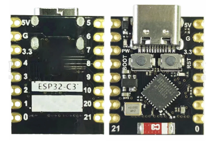|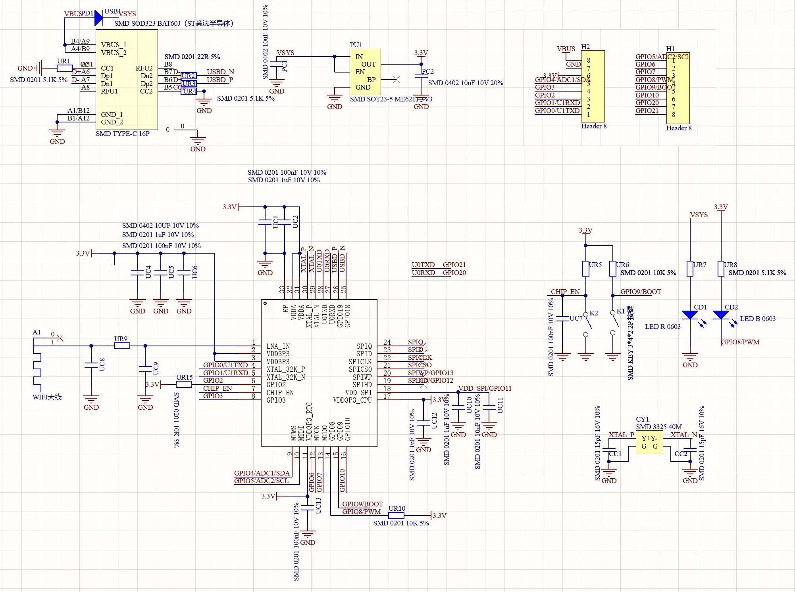|Sử dụng IC dán ME6211 SOT23-5|ESP32 C3|4MB|400KB|13 chân GPIO|1 led nguồn,1 led nối với GPOI8|Type-C|UART, SPI, I2C, PWM, ADC|[link](https://shopee.vn/Samirob-ESP32-C3-ESP32-S3-ESP32-H2-ESP32-C6-Ban-Ph%C3%A1t-Tri%E1%BB%83n-ESP32-C3-SuperMini-WiFi-Bluetooth-ESP32C3-B%E1%BA%A3ng-M%E1%BB%9F-R%E1%BB%99ng-i.578443443.24400570619?sp_atk=9984aad9-bced-4986-8e1f-d91164d2f634&xptdk=9984aad9-bced-4986-8e1f-d91164d2f634)|50.490đ|[link](https://www.dientudat.com/module-thu-phat-wifi-bluetooth-esp32-c3-mini)|
|2|ESP32-S3-mini|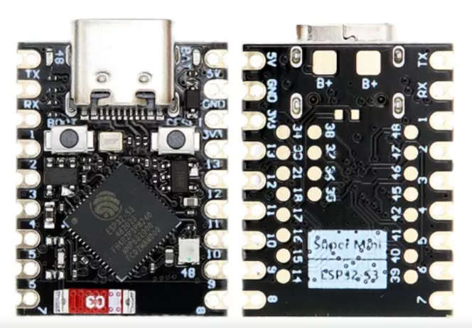|	|	|ESP32 S3|4MB|512KB|14 chân GPIO|1 led nguồn,1 led nối với GPOI48|Type-C|UART, SPI, I2C, PWM, ADC|[link](https://shopee.vn/Samirob-ESP32-C3-ESP32-S3-ESP32-H2-ESP32-C6-Ban-Ph%C3%A1t-Tri%E1%BB%83n-ESP32-C3-SuperMini-WiFi-Bluetooth-ESP32C3-B%E1%BA%A3ng-M%E1%BB%9F-R%E1%BB%99ng-i.578443443.24400570619?sp_atk=9984aad9-bced-4986-8e1f-d91164d2f634&xptdk=9984aad9-bced-4986-8e1f-d91164d2f634)|97.040đ|[link](https://hshop.vn/kit-phat-trien-wifi-ble5-soc-esp32-s3-super-mini-4mb)|
|3|ESP32-WROOM-32|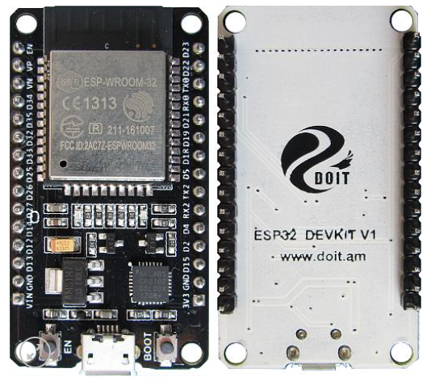|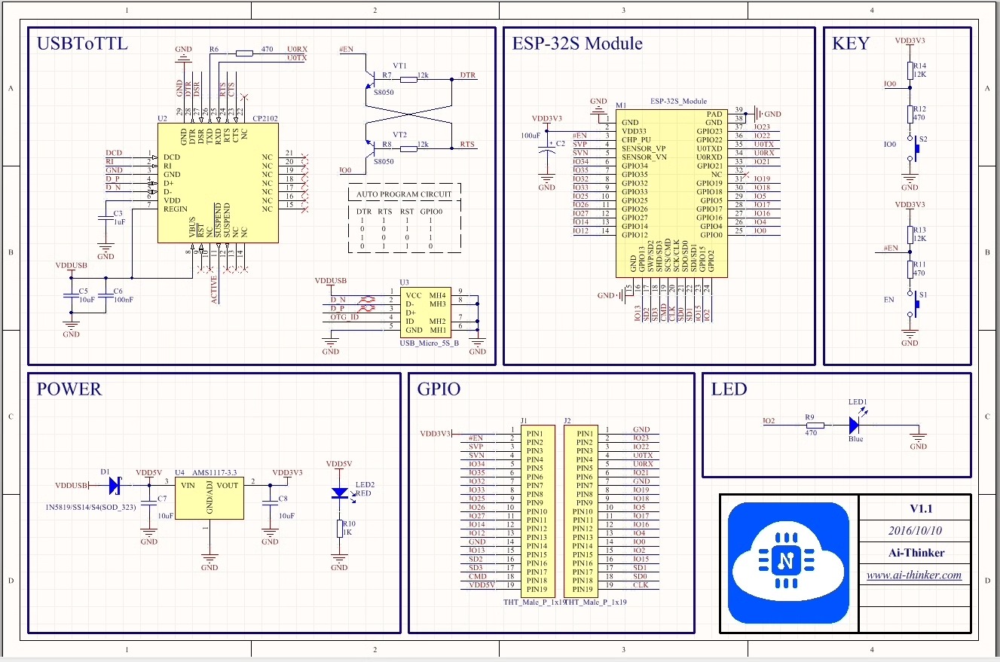|	|ESP32-D0WDQ6|4MB|520KB|25 chân GPIO|1 led nguồn,1 led nối với D2(GPIO2)|Micro-USB/Type-C|UART, SPI, I2C, PWM, ADC|[link](https://shopee.vn/B%E1%BA%A3ng-m%E1%BA%A1ch-ph%C3%A1t-tri%E1%BB%83n-ESP32-WiFi-Bluetooth-Ultra-Low-Power-Core-ESP-32-ESP-32S-ESP-32-Similar-ESP8266-ch%E1%BA%A5t-l%C6%B0%E1%BB%A3ng-cao-i.578443443.13742226706?sp_atk=eb3a9f73-926b-4712-9b0e-fcdc4c32d55d)|86.526đ|[link](https://banlinhkien.com/kit-wifi-esp32-espwroom32s-p6649289.html)|
|4|ESP32-CAM|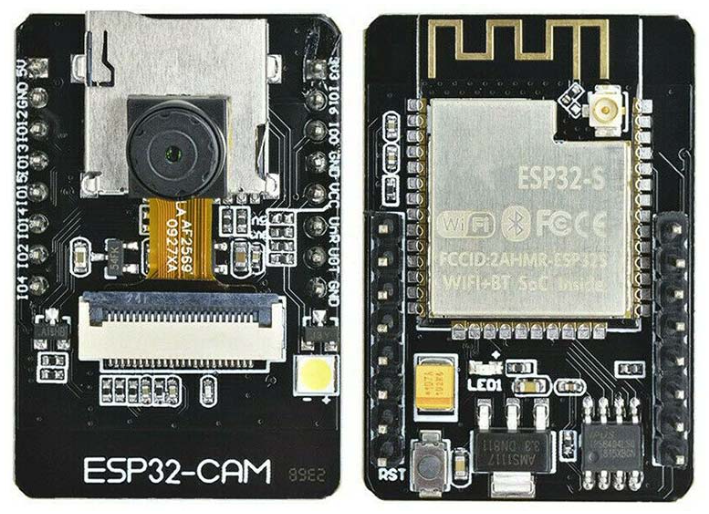|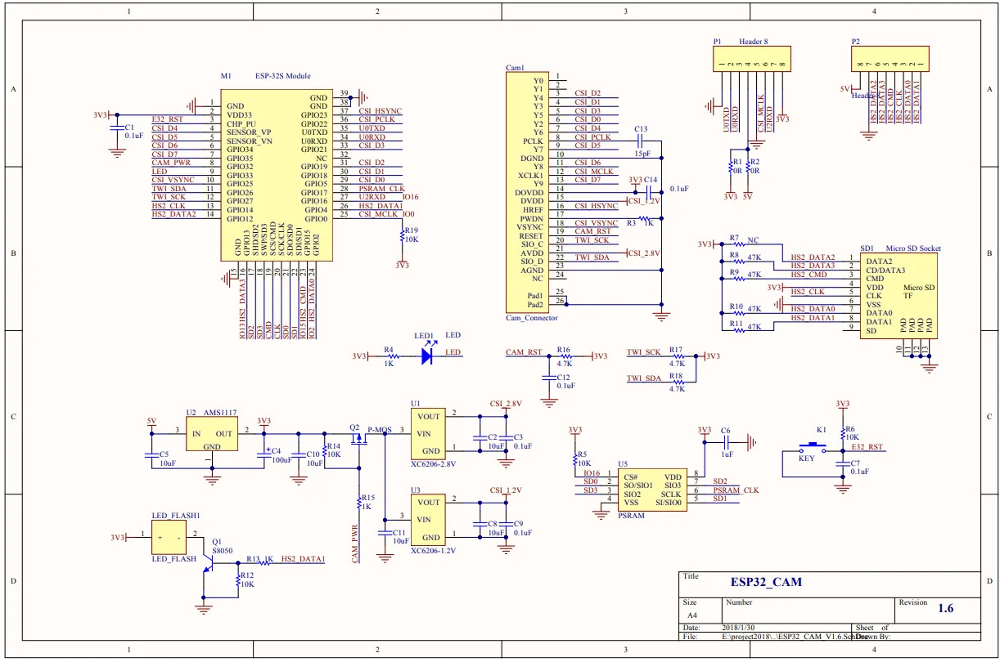|	|ESP32-D0WDQ6|4MB|520KB|10 chân GPIO|1 led nguồn,1 led flash nối với GPOI4|USB TTL|UART, SPI, I2C, PWM|[link](https://shopee.vn/Module-ESP32-CAM-ESP32-c%C3%B3-t%C3%ADch-h%E1%BB%A3p-Camera-WiFi-Bluetooth-4.2-i.1234792873.26518335904?sp_atk=e4426964-8d62-4fb8-b585-73ba85adec9d&xptdk=e4426964-8d62-4fb8-b585-73ba85adec9d)|135.000đ|[link](https://mischianti.org/esp32-cam-high-resolution-pinout-and-specs/)|
|5|ESP32-S2|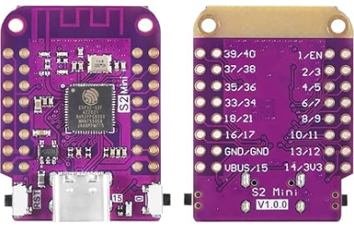|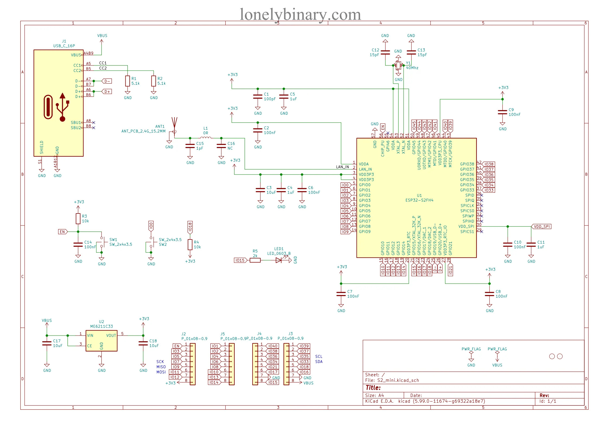|	|ESP32 S2|4MB|-|27 chân GPIO|1 led nguồn,1 led nối với GPOI15|Type-C|UART, SPI, I2C, PWM, ADC|[link](https://shopee.vn/B%E1%BA%A3ng-M%E1%BA%A1Ch-ESP32-S2-Mini-V1.0.0-LOLIN-WIFI-IOT-ESP32-S2FN4R2-ESP32-S2-4MB-FLASH-2MB-PSRAM-MicroPython-Arduino-i.578443443.16380007003?sp_atk=c66504ea-150d-429c-8eb0-0321af64df99&xptdk=c66504ea-150d-429c-8eb0-0321af64df99)|46.640đ|[link](https://www.sudo.is/docs/esphome/boards/esp32s2mini/)|
|6|ESP32-WROOM-32U|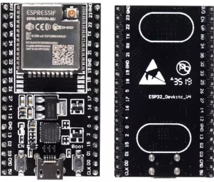|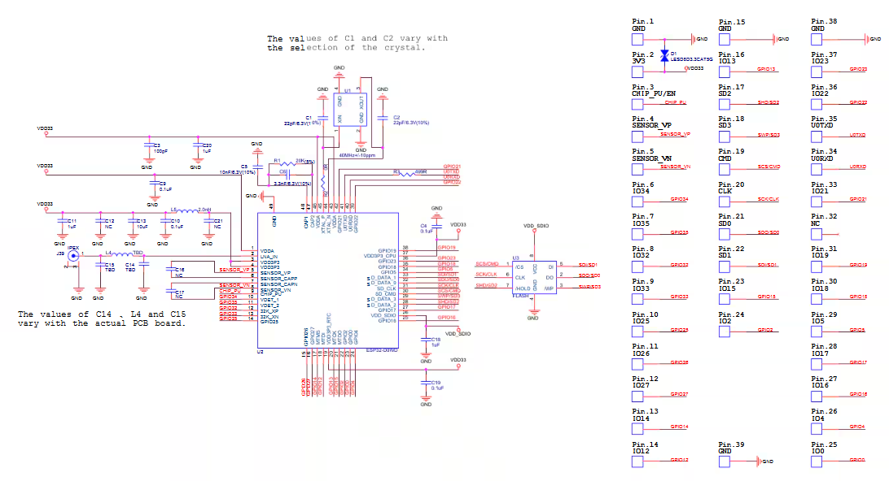|	|ESP32-S0WD|4MB|-|22 chân GPIO|1 led nguồn,1 led nối với 2(GPIO2)|Micro-USB|UART, SPI, I2C, PWM, ADC|[link](https://shopee.vn/B%E1%BA%A3ng-M%E1%BA%A1ch-Ph%C3%A1t-Tri%E1%BB%83n-WiFi-Bluetooth-Esp32-L%C3%B5i-K%C3%A9p-ESP-32-ESP-32S-ESP-32-Similar-ESP8266-i.578443443.14161303136?sp_atk=7ff1e370-45a9-4ae1-a6bc-14eb4fa23c5d&xptdk=7ff1e370-45a9-4ae1-a6bc-14eb4fa23c5d)|77.220đ|[link](https://www.espressif.com/sites/default/files/documentation/esp32-wroom-32d_esp32-wroom-32u_datasheet_en.pdf)|
|7|ESP32-WROOM-32D|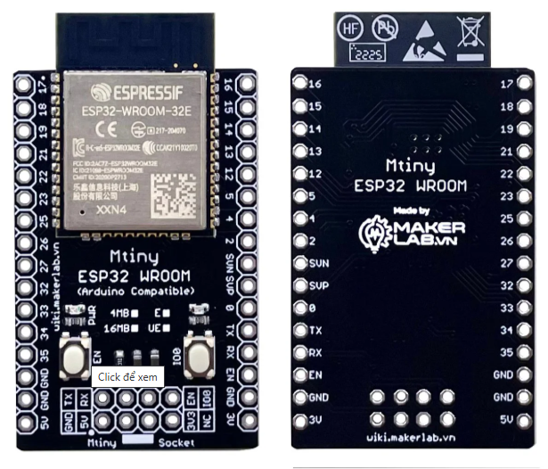||	|ESP32-S0WD|4MB|-|22 chân GPIO|1 led nguồn,1 led nối với 2(GPIO2)|Micro-USB|UART, SPI, I2C, PWM, ADC|[link](https://shopee.vn/B%E1%BA%A3ng-M%E1%BA%A1ch-Ph%C3%A1t-Tri%E1%BB%83n-WiFi-Bluetooth-Esp32-L%C3%B5i-K%C3%A9p-ESP-32-ESP-32S-ESP-32-Similar-ESP8266-i.578443443.14161303136?sp_atk=7ff1e370-45a9-4ae1-a6bc-14eb4fa23c5d&xptdk=7ff1e370-45a9-4ae1-a6bc-14eb4fa23c5d)|77.220đ|[link](https://www.espressif.com/sites/default/files/documentation/esp32-wroom-32d_esp32-wroom-32u_datasheet_en.pdf)|
