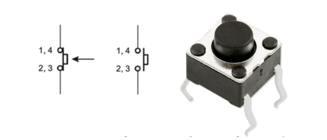
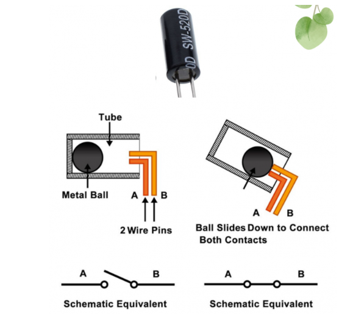
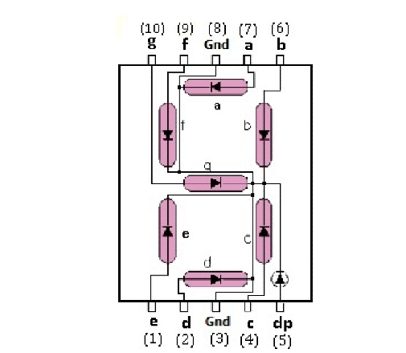
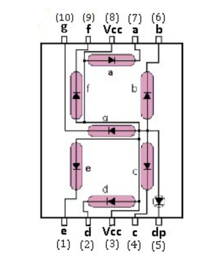
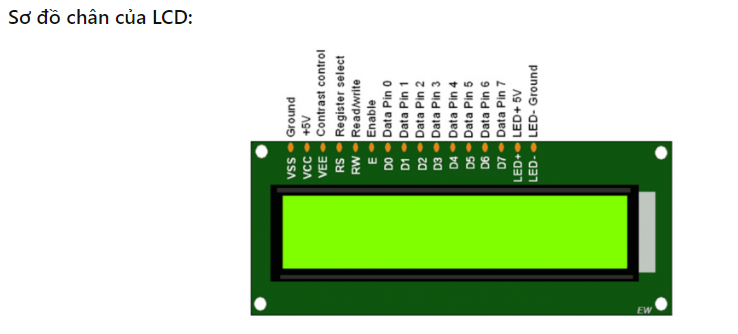

# D23_DoGiaHuy

## A. CÔNG VIỆC ĐÃ LÀM:

### 1. Tìm hiểu cách báo cáo trên gitbup
- Biết upload code lên github bằng cách:
	+ Tải và cài app gitbup desktop.
	+ Clone thư mục đã được anh Nam tạo và cấp quyền về máy tính bằng Sourcetree.
	+ Tạo thư mục báo cáo và Push lên github.
- Biết một số cách trình bày nội dung trên file Maskdown (README.md) như:
	+ Nhấn mạnh bằng cách bôi đậm, thụt vào đầu dòng,...
	+ Cách gắn link, thu gọn link, chú giải nhiều link
- Cách chèn ảnh bằng nhiều kiểu khác nhau
- Cách chèn một source code trong báo cáo
- Cách tạo bẳng trong báo cáo

### 2. Báo cáo công việc đã làm của những tuần trước

#### 2.1 Báo cáo ngày 12/10/2024

2.1.1 Bắt đầu tìm hiểu về arduino và esp32

2.1.1.1 Tìm hiểu về pinout của arduino uno và esp32 38pin	
- ARDUINO UNO:
	+ Trên Board Arduino Uno có 14 chân Digital (từ chân 0 đến chân 13),Điện áp trên mỗi chân là 5V, dòng trên mỗi chân là 20mA và bên trong có điện trở kéo lên là 20-50 ohm
	+ Arduino Uno có 6 chân đầu vào Analog từ A0 đến A5, mỗi chân cung cấp 10 bit độ phân giải
	+ Ngoài ra, một số chân có chức năng đặt biệt như: Serial, PWM, SPI: 10 (SS), 11 (MOSI), 12 (MISO), 13 (SCK)
- ESP32:
	+ Nguồn Điện:
		* 3V3 (3.3V): Cung cấp nguồn 3.3V cho module,
		* GND: Chân nối đất.
	+ Chân Nguồn và Quản Lý:
		- EN: Chân kích hoạt (Enable), khi kéo lên cao (3.3V) thì ESP32 hoạt động, khi kéo xuống thấp (GND) thì ESP32 ngừng hoạt động,
		- VIN: Chân cấp nguồn ngoài cho ESP32 (từ 5V đến 12V).
	+ Analog Pin và Digital Pin:
		- Digital Pin:
			- Digital pins là những chân chỉ có thể nhận hoặc truyền tín hiệu số, tức là tín hiệu có hai trạng thái rõ ràng: HIGH (1) hoặc LOW (0).
		- Chức năng:
			- Đầu ra (Output): Có thể phát ra tín hiệu số, thường dùng để điều khiển các thiết bị ngoại vi như LED, động cơ, relay, v.v.
			- Đầu vào (Input): Có thể nhận tín hiệu từ các thiết bị như nút nhấn, cảm biến có tín hiệu số.	
		- Analog Pin:
			- Analog pins là những chân có khả năng đọc và xử lý tín hiệu tương tự. Tín hiệu tương tự có thể có giá trị liên tục trong một khoảng điện áp cụ thể.
		- Chức năng:
			- Đọc tín hiệu tương tự: Analog pins có thể đo các giá trị điện áp từ 0 đến một điện áp tối đa (thường là 3.3V đối với ESP32) và chuyển đổi chúng thành giá trị số.
			- Chuyển đổi ADC: Sử dụng ADC (Analog to Digital Converter) để chuyển đổi tín hiệu tương tự thành tín hiệu số, giúp vi điều khiển xử lý dữ liệu.
	CHI TIẾT: [Link](https://github.com/eleptit-club/ELE-D23-DoGiaHuy/tree/main/ESP32/241019)

2.1.1.2 Học các hàm chức năng digital và analog qua [Link](https://docs.arduino.cc/language-reference/en/functions/digital-io/digitalread/)
- Em đã ghi chép lại qua [Link](https://docs.google.com/document/d/1sSXAhn731Ds_lqACL0Tv5UjbToF_tf_ileaAPmiWsms/edit?tab=t.0#heading=h.dh0lm8h6g3js)

2.1.1.3 Đồng thời học mắc mạch cùng với các linh kiện là led, nút bấm, biến trở, cùng code qua [Link](https://nshopvn.com/blog/tai-lieu-arduino-starter-kit-2021/#den-led)
- Led:
	+ Đèn led hay còn gọi là điốt phát quang, là một biến thể của diode cơ bản, nó xác định độ chênh lệch điện áp nhỏ nhất giữa Anode (+ ) và Cathode (-), led khác diode ở chỗ là tạo ra ánh sáng khi dòng điện đi qua. Đèn led cần được kết nối đúng âm dương của nguồn điện để hoạt động. Đèn led có rất nhiều màu sắc khác nhau: đỏ, vàng, xanh lá, xanh dường, trắng…
	+ Bài tập nháy led theo các hiệu ứng như hiệu ứng giọt nước, cánh bướm, bóng rơi,...

- Biến trở:
	+ Biến trở là một dạng điện trở có thể thay đổi giá trị, ví dụ điện trở 10kΩ thì giá trị của nó chỉ là 10kΩ, còn biến trở 10kΩ là có thể thay đổi từ 0 ~ 10kΩ. Cấu tạo của biến trở rất đơn giản bao gồm: con chạy, cuộn dây được làm bằng hợp kim có điện trở công suất lớn, chân ngõ ra 3 chân. Biến trở được ứng dụng rộng rãi trong các mạch điện tử, được dùng để điều chỉnh sai số, điều chỉnh phân áp, phân dòng trong mạch… Ví dụ dùng để tăng giảm âm lượng trong các mạch âm thanh, tăng giảm độ sáng của đèn…
	+ Bài tập đọc giá trị biến trở bằng serial

- Nút nhấn:
	+ Nút nhấn là một dạng công tắc đơn giản để đóng ngắt các thiết bị hoặc điều khiển một số hoạt động, quá trình của các thiết bị điện tử, máy móc. Hầu hết, các nút nhấn được làm bằng nhựa hoặc kim loại. Nút nhấn có 2 loại là nút nhấn thường đóng và thường mở.
	+ Cấu tạo: Nút nhấn gồm hệ thống lò xo, hệ thống các tiếp điểm thường hở – thường đóng và vỏ bảo vệ. Khi tác động vào nút nhấn, các tiếp điểm chuyển trạng thái, khi không còn tác động, các tiếp điểm trở về trạng thái ban đầu.
	+ Tìm hiểu sơ đồ chân của nút nhấn 
	+ Bài tập: đọc trạng thái nút nhấn báo qua LED

#### 2.2 Báo cáo ngày 19/10/2024

2.2.1 Tiếp tục tìm hiểu về arduino và esp32

2.2.1.1 Học tiếp các hàm chức năng time**
- Em vẫn ghi lại qua [Link](https://docs.google.com/document/d/1sSXAhn731Ds_lqACL0Tv5UjbToF_tf_ileaAPmiWsms/edit?tab=t.0#heading=h.dh0lm8h6g3js)
		
2.2.1.2 Học mắc mạch cùng với các linh kiện là còi buzz thụ động, quang trở, cảm biến nghiêng, cùng code**
- Còi buzz thụ động:
	+ Chỉ cần cấp nguồn là phát ra âm thanh, còn còi buzz thụ động không có bộ dao động bên trong nên khi cấp một tần số từ 2Khz – 5Khz còi sẽ phát âm thanh tùy theo tần số và thời gian, còi thụ động giúp chúng ta kiểm soát được nhiều hiệu ứng âm thanh.
	+ Bài tập: Một vài nốt nhạc tìm hiểu các câu lệnh

- Quang trở:
	+ Quang trở hay điện trở quang, photoresistor, photocell, LDR ( Light-dephendent resistor), là linh kiện điện tử được làm bằng chất đặc biệt có điện trở thay đổi giảm theo mức ánh sáng chiếu vào. Ở nơi có ít ánh sáng thì giá trị điện trở tăng cao có thể lên đến vài MΩ, còn nơi có ánh sáng mạnh thì giảm còn vài trăm Ω.Quang trở hoạt động dựa trên hiệu ứng quang điện trong khối vật chất. Khi photon có năng lượng đủ lớn đập vào, sẽ làm bật electron khỏi phân tử, trở thành tự do trong khối chất và làm chất bán dẫn thành dẫn điện. Mức độ dẫn điện tùy thuộc vào số photon được hấp thụ. Tùy thuộc chất bán dẫn mà quang trở phản ứng khác nhau với bước sóng photon khác nhau.
	+ Bài tập: Sử dụng cầu chia áp để đọc giá trị thay đổi của quang trở với Arduino.

- Cảm biến nghiêng:
	+ Các cảm biến độ nghiêng kiểu công tắc bóng này là một loại công tắc kỹ thuật số thay đổi trạng thái từ mở sang đóng dựa trên độ nghiêng của nó so với vector trường hấp dẫn của trái đất. Về mặt điện, chúng hoạt động giống như nút nhấn, nơi các tiếp điểm dẫn điện khi công tắc đóng và không dẫn điện khi nó mở ra. Về mặt cơ học, chúng thường bao gồm một vỏ rỗng và một khối tự do dẫn điện bên trong; trên một đầu của vỏ, cảm biến có hai hoặc nhiều phần tử dẫn điện bị đoản mạch khi hướng của cảm biến đến mức khối lượng tự do bên trong cuộn và tiếp xúc vật lý với chúng.
	+ Tìm hiểu cấu tạo cảm biến nghiêng 
	+ Bài tập: kiểm tra cảm biến có nghiêng hay không và báo qua đèn led

#### 2.3 Báo cáo ngày 26/10/2024

2.3.1 Tiếp tục tìm hiểu về arduino và esp32

2.3.1.1 Học mắc mạch cùng với các linh kiện là Led 7 đoạn, màn hình LCD 1602, cùng code**
- Led 7 đoạn:
	+ Led 7 đoạn hay Led 7 thanh (Seven Segment Display) gổm 7 thanh led đơn sắp xếp theo hình chữ “8”. Hầu hết các led 7 đoạn thực sự có 8 phân đoạn, với một dấu chấm ở phía bên phải của chữ số đóng vai trò là dấu thập phân. Mỗi đoạn được đặt tên bằng chữ từ A -> G và DP cho dấu thập phân. Mỗi phân đoạn đều có thể được điều khiển riêng lẻ, giống như một đèn LED thông thường. Có 2 loại led 7 đoạn là Anode chung và Cathode chung.
	+ Tìm hiểu sơ đồ chân của led 7 đoạn:
 	   
	+ Bài tập: Hiển thị các số từ 0 đến 9, kết hợp với nút bấm để hiển thị từ 0 đến 9

- Màn hình LCD:
	+ Màn hình LCD với khả năng hiển thị 2 dòng với mỗi dòng 16 ký tự, có thể hiển thị các kí tự đa dạng (chữ, số, kí tự đồ họa), được ứng dụng nhiều trong các board mạch điện tử khác nhau.
	+ Tìm hiểu sơ đồ chân của LCD: 
	+ Bài tập: hiển thị chữ ra màn hình LCD
	
2.3.2 Tìm hiểu cách báo cáo trên gitbup (đã báo cáo ở trên)

		
## B. BÀI TẬP

### 5Bài: Sáng dần tắt dần, giọt nước, cánh bướm, rắn săn mồi, chuyển từ 1 đến 255 sang nhị phân(sáng bằng led)

		#### Bài1. Led sáng dần tắt dần
			https://drive.google.com/file/d/1XInBeQsgWI1CyQxFfWlPUlAa4b7TFEDa/view?usp=sharing
		```cpp
		int led[8]={13,12,14,27,26,25,33,32};

		void setup() {
		  // put your setup code here, to run once:
		  for(int i=0; i<8; i++){
			pinMode(led[i],OUTPUT);
		  }
		}

		void loop() {
		  for(int i=0;i<8;i++){
			digitalWrite(led[i],1);
			delay(100);
		  }
		  for(int i=8;i>=0;i--){
			digitalWrite(led[i],0);
			delay(100);
		  }
		}
		```
		#### Bài2. Hiệu ứng giọt nước
			https://drive.google.com/file/d/1PtJ0N5xqZGXm7jWjAmf8SWWym3HLZHic/view?usp=sharing
		```cpp
		int led[8]={13,12,14,27,26,25,33,32};

		void setup() {
		  // put your setup code here, to run once:
		  for(int i=0; i<8; i++){
			pinMode(led[i],OUTPUT);
		  }
		}

		void loop() {
		  int b = 7;
		  for(int j=0;j<8;j++){
			for(int i=0;i<=b;i++){
			  digitalWrite(led[i],HIGH);
			  delay(50);
			  if(i != b){
				digitalWrite(led[i],LOW);
				delay(50);
			  }
			}
			b--;
		  }
		  for(int i=0;i<8;i++){
			  digitalWrite(led[i],LOW);
			  delay(1);
		}
		```
		#### Bài3. Hiệu ứng cánh bướm
			https://drive.google.com/file/d/1dOiBS-S3SApkABgt-ShvpztX68HUcZkJ/view?usp=sharing
		```cpp
		int led[8]={13,12,14,27,26,25,33,32};

		void setup() {
		  // put your setup code here, to run once:
		  for(int i=0; i<8; i++){
			pinMode(led[i],OUTPUT);
		  }
		}

		void loop() {
		  int a=3;
			int b=4;
		  for(int i=0;i<4;i++){
			digitalWrite(led[a],1);
			digitalWrite(led[b],1);
			delay(200);
			a--;
			b++;
		  }
		  int m=7;
		  int n=0;
		  for(int i=0;i<4;i++){
			digitalWrite(led[m],0);
			digitalWrite(led[n],0);
			delay(200);
			m--;
			n++;
		  }
		}
		```
		#### Bài4. Hiệu ứng rắn săn mồi
			https://drive.google.com/file/d/1WiFvh6EeyKEVU8W4LRGTDZ6RtsbJUEAv/view?usp=sharing
		```cpp
		int led[8]={13,12,14,27,26,25,33,32};

		void batden(int x){
		  for(int i=0;i<x;i++){
			digitalWrite(led[i],HIGH);
			delay(1);
		  }
		  delay(400);
		}

		void setup(){
		  for(int i=0;i<8;i++){
			pinMode(led[i],OUTPUT);
		  }
		}

		void loop(){
		  digitalWrite(led[7],HIGH);
		  int i=0;
		  while(i<7){
			batden(i);
			for(int j=0;j<7;j++){
			  digitalWrite(led[j+i],HIGH);
			  delay(200);
			  digitalWrite(led[j],LOW);
			  delay(200);
			}
			i++;
		  }
		}
		```
		#### Bài5. Chuyển từ 1 đến 255 sang nhị phân(sáng bằng led)
			https://drive.google.com/file/d/16_ukkg7Ak7KepVbQeDGaixUwcmDgqTqV/view?usp=sharing
		```cpp
		int led[8]={13,12,14,27,26,25,33,32};

		void setup(){
		  for(int i=0;i<8;i++){
			pinMode(led[i],OUTPUT);
		  }
		}

		void loop(){
		  for(int i=1;i<256;i++){
			int dp[8]={0};
			int x=i;
			for(int i=7;i>=0;i--){
			  dp[i]=x%2;
			  x/=2;
			}
			for(int j=0;j<8;j++){
			  digitalWrite(led[j],dp[j]);
			  delay(1);
			}
			delay(1000);
			for(int j=0;j<8;j++){
			  digitalWrite(led[j],0);
			  delay(1);
			}
			delay(1000);
		  }
		}
		```
### Bài tập về biến trở và nút nhấn

		#### Bài1. Đọc giá trị biến trở bằng serial
		```cpp
		void setup ()
		{
		   Serial.begin(9600); //Mở cổng Serial ở baudrate 9600
		}
		void loop()
		{
			int giatri = analogRead(A2);
		    Serial.println(giatri);
			int dienap;
		   dienap = map(giatri,0,1023,0,5000);
		   Serial.println(dienap);
		   delay(1000);
		}
		```
		
		#### Bài2. Đọc trạng thái nút nhấn báo qua LED
		```cpp
		int button = 11; // Nút nhấn được kết nối với chân 11 của Arduino
		int led = 2; // Led được kết nối với chân 2 của Arduino
		void setup()
		{
			Serial.begin(9600); // Mở cổng Serial ở baudrate 9600
			pinMode(button, INPUT); // Khai báo chân D11 ở trạng thái đọc dữ liệu
			pinMode(led,OUTPUT); // Khai báo chân nối led là ngõ ra
		}
		void loop()
		{
			int buttonStatus = digitalRead(button); //Đọc trạng thái button
			if (buttonStatus == HIGH) // Nếu mà button bị nhấn
				{
					Serial.println("Nut dang duoc nhan");
					digitalWrite(led,HIGH); // Đèn led sáng
				}
			else
				{
					digitalWrite(led,LOW); // ngược lại button không bị nhấn
					Serial.println ("Nut chua duoc nhan");
				}
		}
		```
		
## C. Khó Khăn
	- Chưa có

## D. Mượn Đồ của CLB
	- Không
