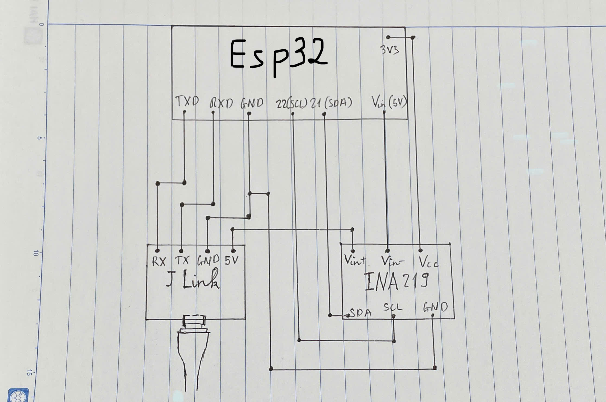
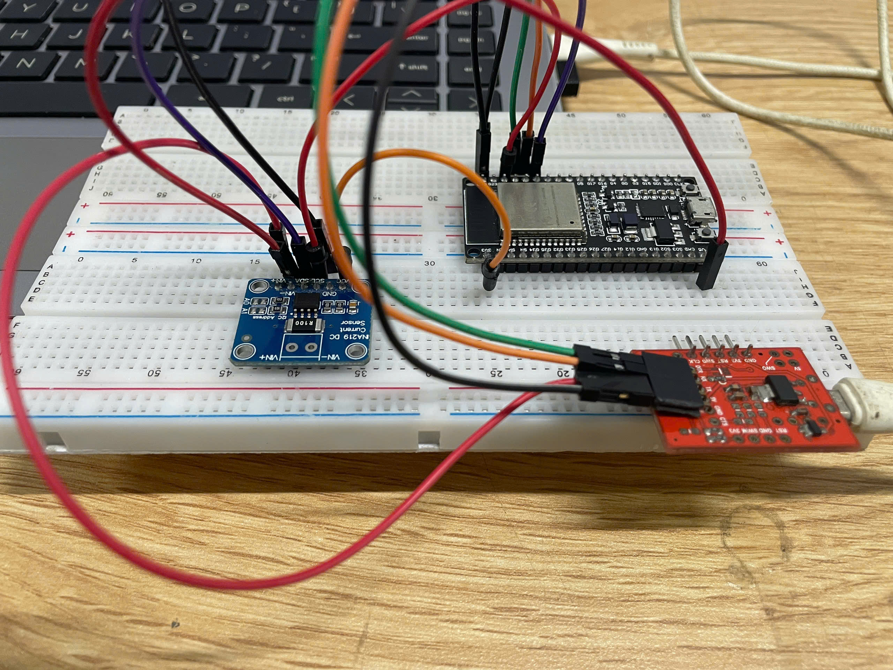

# D23_DoGiaHuy Báo cáo công việc ngày 29/03/2025

## A. NỘI DUNG ĐÃ TÌM HIỂU

### 1. Bỏ việc lấy nguồn (5v đến Vin-) từ Arduino nano thay bằng lấy nguồn 5v luôn từ J-link

- Ảnh sơ đồ mạch lý thuyết:



- Ảnh sơ đồ mạch thực tế:



### 2. Thực hiện đẩy dữ liệu đọc được từ INA219 lên google sheet

- Link tìm hiểu: https://randomnerdtutorials.com/esp32-datalogging-google-sheets/

####  Hàm setup()

```cpp
void setup() {
    Serial.begin(115200);
    while (!Serial) { delay(1); }
    Serial.println("Starting...");
```

- Bật Serial Monitor với tốc độ 115200 baud.

- Đợi Serial sẵn sàng.


```cpp	
if (!ina219.begin()) {
        Serial.println("Failed to find INA219 chip");
        while (1) { delay(10); }
    }
    Serial.println("INA219 Initialized");
```

- Kiểm tra xem INA219 có hoạt động không. Nếu không báo kết nối thất bại và kết nối lại

	
```cpp
    WiFi.begin(WIFI_SSID, WIFI_PASSWORD);
    Serial.print("Connecting to Wi-Fi");
    while (WiFi.status() != WL_CONNECTED) {
        Serial.print(".");
        delay(1000);
    }
    Serial.println();
    Serial.print("Connected with IP: ");
    Serial.println(WiFi.localIP());
```

- Kết nối với wifi, nếu kết nối thành công, hiển thị địa chỉ IP.


```cpp
    GSheet.setTokenCallback(tokenStatusCallback);
    GSheet.setPrerefreshSeconds(10 * 60);
    GSheet.begin(CLIENT_EMAIL, PROJECT_ID, PRIVATE_KEY);
```

- Cấu hình Google Sheets API.

- Thiết lập callback để kiểm tra trạng thái token.

- Đặt thời gian làm mới token là 10 phút.

#### Hàm loop()

- Hàm loop() thực hiện gửi dữ liệu lên Google Sheets sau mỗi 30 giây.

```cpp
void loop() {
    bool ready = GSheet.ready();
    if (ready && millis() - lastTime > timerDelay) {
```

- Kiểm tra nếu Google Sheets API đã sẵn sàng.

- Kiểm tra nếu đã đến thời gian gửi dữ liệu tiếp theo.


```cpp
	lastTime = millis();
	FirebaseJson response;
	FirebaseJson valueRange;
```

- response: Lưu phản hồi từ Google Sheets.

- valueRange: Định dạng dữ liệu sẽ gửi lên Google Sheets.


```cpp
	float shuntvoltage = ina219.getShuntVoltage_mV();
	float busvoltage = ina219.getBusVoltage_V();
	float current_mA = ina219.getCurrent_mA();
	float power_mW = ina219.getPower_mW();
	float loadvoltage = busvoltage + (shuntvoltage / 1000);
```

- getShuntVoltage_mV() → Điện áp rơi trên shunt (mV).

- getBusVoltage_V() → Điện áp bus (V).

- getCurrent_mA() → Dòng điện (mA).

- getPower_mW() → Công suất (mW).

- loadvoltage → Điện áp thực tế tải tiêu thụ.


```cpp
	Serial.println("Appending data to Google Sheets...");
	
	valueRange.add("majorDimension", "COLUMNS");
	valueRange.set("values/[0]/[0]", millis()); // Timestamp
	valueRange.set("values/[1]/[0]", busvoltage);
	valueRange.set("values/[2]/[0]", shuntvoltage);
	valueRange.set("values/[3]/[0]", loadvoltage);
	valueRange.set("values/[4]/[0]", current_mA);
	valueRange.set("values/[5]/[0]", power_mW);
```

- Tạo cấu trúc dữ liệu JSON để gửi lên Google Sheets.


```cpp
    bool success = GSheet.values.append(&response, spreadsheetId, "Sheet1!A1", &valueRange);
```

- Gửi dữ liệu lên Google Sheets, ghi vào bảng "Sheet1", bắt đầu từ ô "A1".


```cpp
        if (success) {
            response.toString(Serial, true);
            valueRange.clear();
        } else {
            Serial.println(GSheet.errorReason());
        }
        Serial.println();
    }
}
```

- Nếu gửi thành công, in phản hồi từ Google Sheets.

- Nếu gửi thất bại, in ra lỗi.


```cpp
void tokenStatusCallback(TokenInfo info) {
    if (info.status == token_status_error) {
        GSheet.printf("Token Error: %s\n", GSheet.getTokenError(info).c_str());
    } else {
        GSheet.printf("Token Status: %s\n", GSheet.getTokenStatus(info).c_str());
    }
}
```

- Kiểm tra trạng thái xác thực với Google Sheets API.

- Nếu có lỗi, in ra lỗi token.

#### File code full

- https://github.com/ptitopen-git/D23_DoGiaHuy/blob/main/LAB/250329/INA219_GS_do_dong_tieu_thu/INA219_GS_do_dong_tieu_thu.ino

## B. KHÓ KHĂN

- Lúc e mới tìm hiểu thì khi chạy chương trình có bị lỗi reset liên tục, sau khi đo lại điện áp của esp thì chương trình lại chạy bình thường, em chưa rõ tại sao ạ

## C. CÔNG VIỆC TIẾP THEO

- Tiếp tục thực hiện đo điện áp tiêu thụ của 2 module esp32 khi ở trạng thái bình thường và trạng thái ngủ.

## D. CẦM ĐỒ CỦA LAB

|Tên linh kiện 						   | Số lượng |
|--------------------------------------|----------|
|Mạch cảm biến dòng điện điện áp INA219|    5     |
